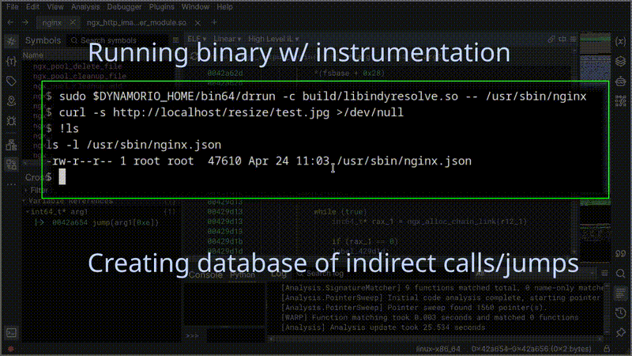

# IndyResolve



Indirect jumps or calls (vtables, function pointers, switch tables) are a pain when reverse-engineering a binary statically.

IndyResolve is a quick tool I put together to bridge the gap between dynamic and static analysis. It uses a DynamoRIO client to trace indirect calls/jumps at runtime, and a Binary Ninja plugin to ingest that data. It patches the resolved targets straight into the Medium Level IL (MLIL), so your decompilation actually makes sense and cross-references work.

## How it works

The project is split into two parts:
1. **The DynamoRIO Client (`indyresolve.c`)**: You run your target binary under this. It hooks indirect branches, figures out where they're going, and dumps the mappings to a JSON file when the thread exits. It's smart enough to separate intra-module calls from external library calls.
2. **The Binary Ninja Plugin (`indyresolve.py`)**: You run this inside Binja. It reads the JSON, finds the unresolved MLIL instructions, and forces their destination variables to constant values (or sets of values, if the branch went to multiple places during runtime). It also adds comments and wires up indirect branches. 

## Installation

First, install DynamoRIO and set the `DYNAMORIO_HOME` environment variable to the DynamoRIO path.

```bash
export DYNAMORIO_HOME=/path/to/dynamorio
```

Then, compile the project:

```
mkdir build
cd build
cmake ..
make
```


This builds libindyresolve.so (the DR client) and a demo executable you can test it on.

You'll also need to copy the `indyresolve.py` file into your Binary Ninja plugin folder (`$HOME/.binaryninja/plugins/` by default on Linux)

## Usage


### 1. Tracing the binary (Dynamic)

Run your target executable under DynamoRIO using the compiled client:

```bash
$DYNAMORIO_HOME/bin64/drrun -c /path/to/libindyresolve.so -- ./your_target
```

When the program finishes, you should see new JSON files in your current directory (e.g., /full/path/to/your_target.json). The client also creates JSON files for each loaded libraries, in each library folder, if it has write access to them.

You can run your program more than one time (i.e. to provide different user inputs), the JSON results will be merged (not overwritten). To restart from scratch and "forget" previous runs, simply delete the JSON files manually.

### 2. Importing into Binary Ninja (Static)

 * Open your target binary in Binja.
 * Go to Plugin -> Import indirect call database 
 * Select the .json file generated by the DynamoRIO client.

The plugin will run through the binary and update the analysis. For each indirect call or jump, it will sets user-defined data-flows, comments, and user branches to wire up the jump/call site to their destination.

If the code jumps into an external library, right-click the instruction and select "Follow indirect external call/jump". If you have that library open in another Binja tab, it'll instantly switch tabs and jump straight to the target function.

## Testing 

There's a simple demo.c included in the repo. If you build the project, it'll compile demo. Run it under drrun, load it in Binja, and import the JSON to see how the indirect f() call gets resolved perfectly.

<video src="https://raw.githubusercontent.com/YOUR_USERNAME/indyresolve/main/assets/demo.mp4" controls="controls" muted="muted" width="100%">
</video>

## Full demonstration with nginx

Nginx is notorious for having a lot of indirect transfer of control, including calls to external libraries. 

Here is a full demonstration of tracing nginx and resolving a chain of indirect transfer of controls, landing in the `ngx_http_image_filter_module.so` module.

https://github.com/user-attachments/assets/70dc73fd-236c-4ec6-aefe-f145e98b3b78

## Ideas for improvements

 * Add support for other architectures or systems (only tested on x86_64 / Linux, for now)
 * Add support for Ghidra, etc.
 * Improve performances of the DR client by removing clean-calls
 * Try other instrumentation framework (QBDI, etc) 
 

